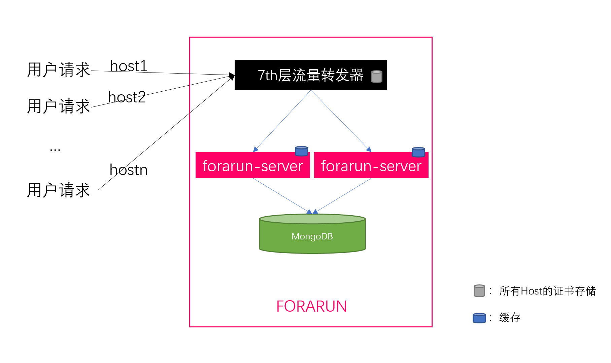

# Forarun自助建站Light系统

### 架构图

1. 我们主要做`forarun-server`的开发，所有状态和数据持久化存储在MongoDB，一些热点数据会在运行时加载到进程内存中做缓存（比如用户会话信息）
2. `forarun-server`被设计成无装态的服务，可以根据流量多实例部署。
### 开放接口文档
一些功能的被设计为RESTfulAPI，请查阅：[https://fora.run/swagger/index.html](https://fora.run/swagger/index.html)

### LICENSE
[Apache License Version 2.0](LICENSE)
